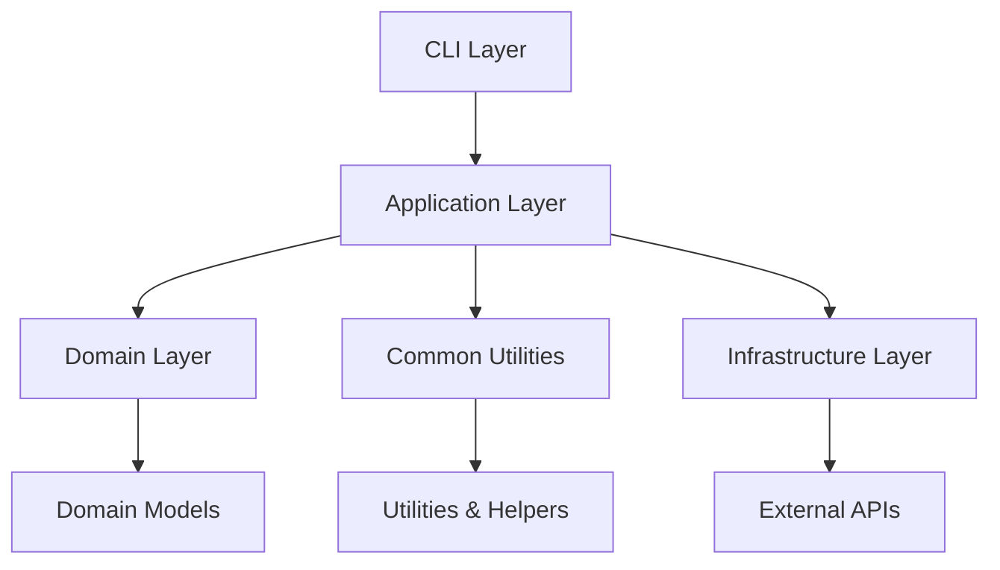
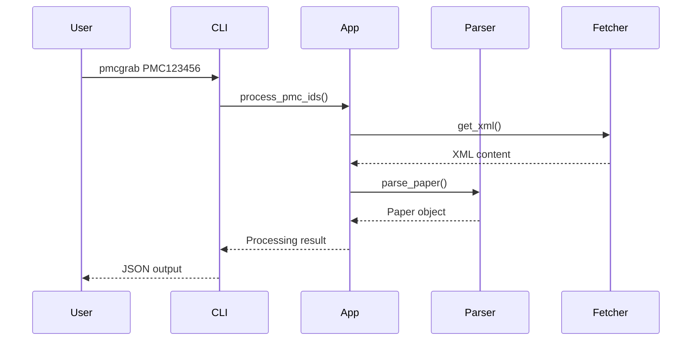

# Architecture

PMCGrab follows clean architecture principles with clear separation of concerns.

## Overview



## Layer Descriptions

### CLI Layer (`pmcgrab.cli`)

- Command-line interface
- Argument parsing
- User interaction
- Progress reporting

### Application Layer (`pmcgrab.application`)

- Use case orchestration
- Business workflow logic
- Paper construction
- Content parsing coordination

### Domain Layer (`pmcgrab.domain`)

- Core business entities
- Value objects
- Domain rules
- No external dependencies

### Common Layer (`pmcgrab.common`)

- Shared utilities
- HTML cleaning
- XML processing
- Serialization helpers

### Infrastructure Layer (`pmcgrab.infrastructure`)

- External API clients
- HTTP utilities
- Settings management
- I/O operations

## Key Components

### Paper Model

The central domain entity representing a PMC article:

```python
@dataclass
class Paper:
    pmcid: str
    title: str
    authors: List[Author]
    abstract: Dict[str, str]
    body: Dict[str, str]
    citations: List[Citation]
    # ... other fields
```

### Parser System

Modular parsing system with specialized parsers:

- `MetadataParser`: Article metadata
- `ContentParser`: Main content sections
- `ContributorParser`: Authors and affiliations
- `SectionParser`: Section organization

### Processing Pipeline



## Design Patterns

### Factory Pattern

Used for creating Paper objects from various sources:

```python
class PaperFactory:
    @staticmethod
    def from_pmc(pmcid: str) -> Paper:
        # Construction logic

    @staticmethod
    def from_xml(xml_content: str) -> Paper:
        # Construction logic
```

### Strategy Pattern

Different parsing strategies for different content types:

```python
class ContentParser:
    def __init__(self, strategy: ParsingStrategy):
        self.strategy = strategy

    def parse(self, content: str) -> Dict:
        return self.strategy.parse(content)
```

### Builder Pattern

Complex Paper object construction:

```python
class PaperBuilder:
    def add_metadata(self, metadata: Dict) -> 'PaperBuilder':
        # Add metadata
        return self

    def add_content(self, content: Dict) -> 'PaperBuilder':
        # Add content
        return self

    def build(self) -> Paper:
        # Construct final Paper object
```

## Data Flow

### Single Paper Processing

1. **Input**: PMC ID from user
2. **Fetch**: Download XML from NCBI
3. **Parse**: Extract structured data
4. **Build**: Construct Paper object
5. **Output**: Serialize to JSON

### Batch Processing

1. **Input**: List of PMC IDs
2. **Chunk**: Split into batches
3. **Parallel**: Process batches concurrently
4. **Aggregate**: Collect results
5. **Report**: Generate summary

## Error Handling

### Error Types

```python
class PMCGrabError(Exception):
    """Base exception for PMCGrab"""

class NetworkError(PMCGrabError):
    """Network-related errors"""

class ParsingError(PMCGrabError):
    """XML parsing errors"""

class ValidationError(PMCGrabError):
    """Data validation errors"""
```

### Error Handling Strategy

- **Fail Fast**: For critical errors
- **Graceful Degradation**: For parsing issues
- **Retry Logic**: For network errors
- **User Feedback**: Clear error messages

## Testing Architecture

### Test Structure

```
tests/
├── unit/           # Unit tests
├── integration/    # Integration tests
├── e2e/           # End-to-end tests
├── fixtures/      # Test data
└── conftest.py    # Test configuration
```

### Test Categories

- **Unit Tests**: Individual components
- **Integration Tests**: Component interactions
- **End-to-end Tests**: Full workflows
- **Performance Tests**: Speed and memory usage

## Configuration Management

### Settings Hierarchy

1. Command line arguments (highest priority)
2. Environment variables
3. Configuration files
4. Default values (lowest priority)

### Configuration Schema

```python
@dataclass
class Settings:
    email: str
    timeout: int = 30
    max_retries: int = 3
    batch_size: int = 10
    workers: int = 4
```

## Extension Points

### Custom Parsers

Implement the `ParserInterface`:

```python
class CustomParser(ParserInterface):
    def parse(self, xml_root: Element) -> Dict:
        # Custom parsing logic
```

### Custom Output Formats

Implement the `SerializerInterface`:

```python
class CustomSerializer(SerializerInterface):
    def serialize(self, paper: Paper) -> str:
        # Custom serialization logic
```

## Performance Considerations

### Optimization Strategies

1. **Concurrent Processing**: Multiple workers
2. **Caching**: XML and parsed data
3. **Memory Management**: Streaming for large datasets
4. **Network Optimization**: Connection pooling

### Monitoring

- Processing speed metrics
- Memory usage tracking
- Error rate monitoring
- Network latency measurements

This architecture ensures PMCGrab is maintainable, testable, and extensible while providing excellent performance for both single article and batch processing scenarios.
