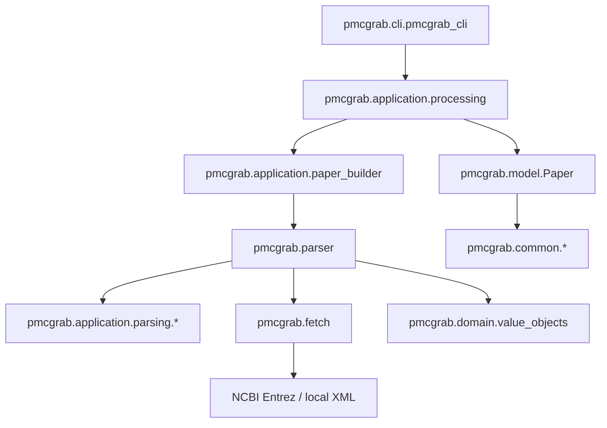
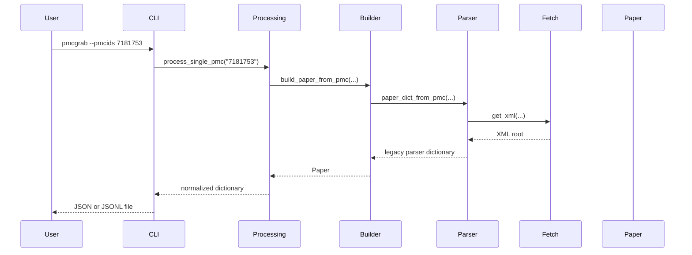
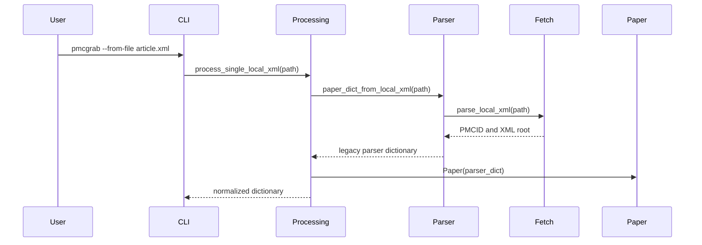

# Architecture

This page documents the current PMCGrab architecture as it exists in the
repository. It is intentionally factual: proposed improvements live in
`docs/development/clean-code-final-plan.md`.

## Current Shape


```mermaid
graph TB
    CLI[pmcgrab.cli.pmcgrab_cli] --> Processing[pmcgrab.application.processing]
    Processing --> Builder[pmcgrab.application.paper_builder]
    Processing --> Model[pmcgrab.model.Paper]
    Builder --> Parser[pmcgrab.parser]
    Parser --> Parsing[pmcgrab.application.parsing.*]
    Parser --> Fetch[pmcgrab.fetch]
    Fetch --> NCBI[NCBI Entrez / local XML]
    Model --> Common[pmcgrab.common.*]
    Parser --> Domain[pmcgrab.domain.value_objects]
```

PMCGrab has a modern package layout, but it is still partly transitional. Some
legacy top-level modules remain public for compatibility, while the primary
processing path now runs through `pmcgrab.application`.

## Main Modules

| Module                                         | Responsibility                                                                   |
| ---------------------------------------------- | -------------------------------------------------------------------------------- |
| `pmcgrab.__init__`                             | Public package exports and version.                                              |
| `pmcgrab.__main__`                             | `python -m pmcgrab` entry point.                                                 |
| `pmcgrab.cli.pmcgrab_cli`                      | Argparse CLI, ID conversion, progress reporting, and file writing.               |
| `pmcgrab.application.processing`               | Pure processing helpers for network PMCID input and local XML input.             |
| `pmcgrab.application.paper_builder`            | Builds `Paper` objects from PMCID inputs.                                        |
| `pmcgrab.parser`                               | Public parser facade and orchestration for XML-to-dictionary extraction.         |
| `pmcgrab.application.parsing.*`                | Focused metadata, contributor, content, and section extraction helpers.          |
| `pmcgrab.model`                                | `Paper`, `TextSection`, `TextParagraph`, `TextTable`, and serialization helpers. |
| `pmcgrab.fetch`                                | Network XML retrieval and local XML parsing.                                     |
| `pmcgrab.idconvert`                            | PMC/PMID/DOI normalization and NCBI ID conversion.                               |
| `pmcgrab.common.*`                             | Output schema ownership, serialization, HTML cleanup, and XML text helpers.      |
| `pmcgrab.infrastructure.settings`              | Environment-driven settings, email rotation, timeout and rate configuration.     |
| `pmcgrab.bioc`, `oa_service`, `oai`, `litctxp` | Lightweight NCBI service clients.                                                |

## Data Flow

### Network PMCID


```mermaid
sequenceDiagram
    participant User
    participant CLI
    participant Processing
    participant Builder
    participant Parser
    participant Fetch
    participant Paper

    User->>CLI: pmcgrab --pmcids 7181753
    CLI->>Processing: process_single_pmc("7181753")
    Processing->>Builder: build_paper_from_pmc(...)
    Builder->>Parser: paper_dict_from_pmc(...)
    Parser->>Fetch: get_xml(...)
    Fetch-->>Parser: XML root
    Parser-->>Builder: legacy parser dictionary
    Builder-->>Processing: Paper
    Processing-->>CLI: normalized dictionary
    CLI-->>User: JSON or JSONL file
```

### Local XML


```mermaid
sequenceDiagram
    participant User
    participant CLI
    participant Processing
    participant Parser
    participant Fetch
    participant Paper

    User->>CLI: pmcgrab --from-file article.xml
    CLI->>Processing: process_single_local_xml(path)
    Processing->>Parser: paper_dict_from_local_xml(path)
    Parser->>Fetch: parse_local_xml(path)
    Fetch-->>Parser: PMCID and XML root
    Parser-->>Processing: legacy parser dictionary
    Processing->>Paper: Paper(parser_dict)
    Processing-->>CLI: normalized dictionary
```

## Public Contracts

The stable high-level APIs are:

```python
from pmcgrab import Paper, process_single_pmc, process_single_local_xml

paper = Paper.from_pmc("7181753")
data = process_single_pmc("7181753")
local = process_single_local_xml("article.xml")
```

The normalized processing dictionary uses the canonical v2 output schema:

- `identifiers` contains PMC, PubMed, DOI, publisher, and other IDs.
- `title` contains main, subtitle, and translated title values.
- `publication` groups journal, publisher, classification, dates, issue, and conference metadata.
- `content` contains the canonical abstract records and ordered section tree.
- `assets` contains parsed references, tables, figures, equations, and supplementary material.
- `provenance` contains parser version, source, timestamp, and XML source path.

Deprecated or legacy modules such as `pmcgrab.processing` remain importable for
compatibility, but new code should use `pmcgrab.application.processing` or the
top-level exports.

## Error Handling

The parser supports two caller choices:

- `suppress_errors=False`: acquisition and parsing errors propagate.
- `suppress_errors=True`: acquisition, local XML parsing, and parser errors are
  converted to empty results where possible.

The CLI treats empty results as failed article processing and continues with the
remaining IDs or files.

## Test Boundaries

Current tests live directly under `tests/`:

- `test_public_api.py` protects package exports and version consistency.
- `test_cli_complete.py` protects argparse behavior and CLI smoke paths.
- `test_local_xml.py` protects local XML parsing and PMCID extraction.
- `test_parser.py`, `test_model.py`, and `test_application_processing.py`
  protect core parsing, model, and processing behavior.
- Service-specific tests cover settings, figures, utilities, HTML cleaning, and
  regressions.

## Known Deepening Work

The current implementation works, but the final clean-code plan identifies
several deeper improvements:

- Make `pmcgrab.parser` a thinner facade over explicit parser services.
- Stabilize table and figure serialization contracts.
- Expand CLI subprocess tests around file output and ID conversion modes.
- Move more compatibility behavior behind explicit adapters.

Those changes are intentionally staged because they affect public API behavior.
